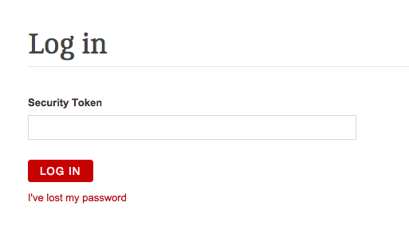

# User guide

## Setting up a user with two factor authentication
Setting up two factor authentication can only be performed by a CMS user with permissions to the Security section of your SilverStripe CMS.

1. Log into the CMS.
2. For a given user select, "Enable Two Factor Authentication" checkbox and save the user. This will generate a Timed One-Time Password token and a QR code to set up in your second factor application (Google Authenticator for example).

4. Scan QR (or enter the token) into your two factor authentication application and use alongside your regular email and password when logging into the CMS.

## Installing Google Authenticator
See the [installation instructions for various mobile devices](https://support.google.com/accounts/answer/1066447?hl=en).

## Setting backup tokens
You can set up backup security tokens just in case you lose access to your second factor device.

1. Log into the CMS (again you will need access to the Security section).
2. For a given user, select the "Backup Tokens" tab.
3. Click "Add OTP Backup Token"

4. Enter a random set of characters to act as the backup token (this is up to you to provide a suitable token). Save.
5. You can now use this token in place of two factor authentication. 

Tokens are single use by default and will be removed from the pool of backup tokens for a given user once entered during the log in process. This can be configured to be multiuse by a developer in the [configuration](configuration.md) by setting `single_use: false`. This is not recomendaed as it negates the improved security of having a second factor involved in your log in process. Effectively you end up with two passwords with this configuration setting, and is only marginally better security wise.
